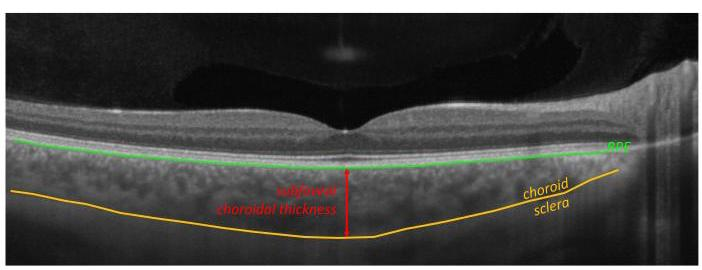
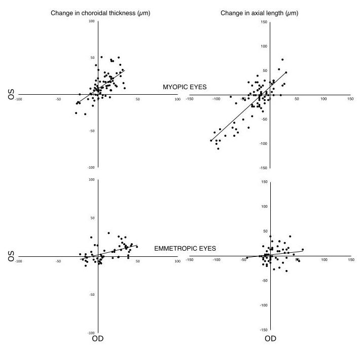
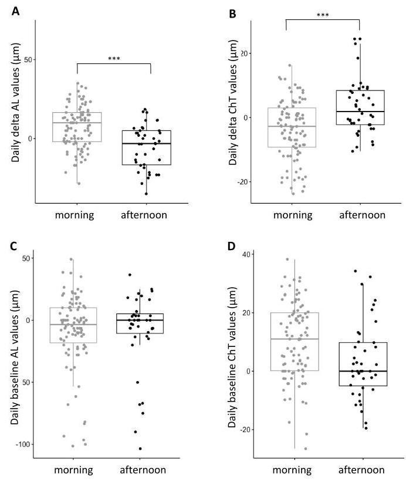
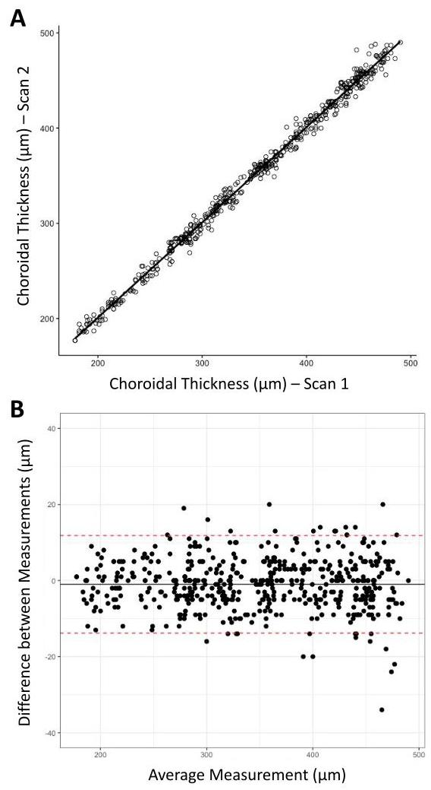
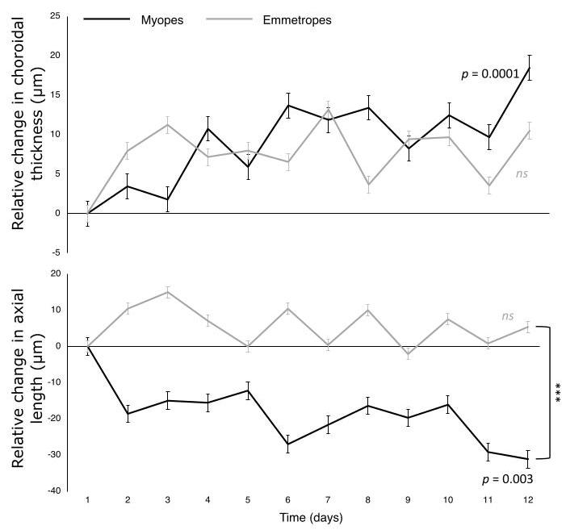
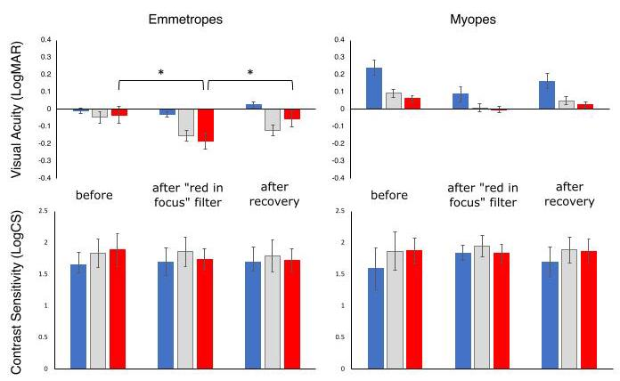

# Pilot study: simulating myopic chromatic aberration on a computer screen induces progressive choroidal thickening in myopes

Barbara Swiatczak,1* Lea Ingrassia,1 Hendrik P. N. Scholl, \( {}^{1,2} \) Frank Schaeffel, \( {}^{1,3} \)

\( {}^{1} \) Institute of Molecular and Clinical Ophthalmology Basel (IOB), Basel, Switzerland

\( {}^{2} \) Department of Ophthalmology, University of Basel, Basel, Switzerland

\( {}^{3} \) Section of Neurobiology of the Eye, Ophthalmic Research Institute, University of Tuebingen, Tuebingen, Germany

Received May 21, 2024, accepted July 19, 2024.

* Correspondence: barbaraswiatczak@gmail.com

## Abstract

The purpose of this study was to determine whether repeated exposure to a digitally simulated myopic chromatic aberration ("red in focus" filter) on a computer screen, can change axial length (AL) and choroidal thickness (ChT) in young human subjects.

Six myopic and four emmetropic subjects worked on a computer screen with a "red in focus" filter for 2 hours per day over 12 consecutive days (days 1-12). The treatment period was followed by 2 days of recovery where subjects performed computer work for 2 hours per day without filtering (days 13 and 14). Before and after each computer work episode, axial length and subfoveal choroidal thickness were measured in both eyes. Additionally, on days 1, 12, and 14, visual acuity and contrast sensitivity were measured in three luminance-matched light conditions: red, blue, and white light.

Myopic, but not emmetropic, eyes showed progressive thickening of the choroid and shortening of the axial length over 12 consecutive days with the "red in focus" filter (AL: \( - {31} \pm  {39\mu }\mathrm{m} \) , \( p < {0.01};\mathrm{{ChT}} :  + {18} \pm  {14\mu }\mathrm{m}, p < {0.0001}) \) with significant recovery when compared to the last days of the treatment period (AL: \( + {10} \pm  {26\mu }\mathrm{m}, p < {0.05} \) ; ChT: \( - {16} \pm  {10\mu }\mathrm{m}, p < {0.001} \) ). Visual acuity improved in both emmetropic and myopic eyes under all light conditions, however, a significant difference was measured only in emmetropic eyes in red light \( ( - {0.03} \pm  {0.15}\mathrm{{vs}} \) . \( - {0.19} \pm  {0.14}\log \) MAR, \( p < {0.05}) \) . Contrast sensitivity did not significantly change during the entire experiment in emmetropic or myopic eyes.

Working on a computer screen with the "red in focus" filter may have an inhibitory effect on myopia progression since it causes progressive thickening of the choroid and associated shortening of axial length over 12 days. However, long-term studies with larger sample sizes are necessary to verify a general effect.

Keywords: myopia, emmetropisation, longitudinal chromatic aberration, myopic defocus

## Introduction

The speed of light depends on the refractive index of a medium (dispersion). This is also valid for the ocular media. Short-wavelength light has a slower propagation speed in the ocular media than longer-wavelength light. According to Snell's law, it is, therefore, more deviated at intraocular refracting surfaces. Accordingly, cornea and crystalline lens have a shorter focal length in blue light, compared to red (longitudinal chromatic aberration, LCA). Since normal-sighted (emmetropic) eyes are in best focus in the mid-wavelength range, the image in the red is focused slightly behind the photoreceptor outer segments while the image in the blue is focused in front, imposing myopic defocus and related chromatic blur.

During postnatal development, the axial length of the eye is adjusted to its optical power, to achieve a close match of the focal plane and photoreceptor plane (emmetropisation). However, regardless of refractive errors (He et al., 2013; Suchkov et al., 2019) or higher-order aberrations (Vinas et al., 2015), the magnitude of LCA is nearly constant across the population (Howarth & Bradley, 1986). Depending on the range of wavelengths of the light spectrum in which measurements are done, LCA amounts to 1.5 to 2 D (He et al., 2013; Howarth & Bradley, 1986; Marcos et al., 1999; Thibos et al., 1990). A classical question of emmetropisation is how the retina might be able to determine the sign of defocus to generate the appropriate eye growth responses (discussion: Schaeffel and Wildsoet (2013)). A plausible strategy might be comparing image contrast in the red and the blue since it would provide a clear indication of the sign of defocus. Indeed, animals deprived of LCA by being reared in spectrally narrowband light develop a wide range of refractive errors (e.g., tree shrew: Gawne et al. (2018) and She et al. (2023); chicken: Chun et al. (2023) and Wang et al. (2018); rhesus monkey: Hung et al. (2018) and Smith et al. (2015)). Recently it has been shown in tree shrews that chromatically simulated myopic defocus, produced by blurring the blue plane of the image, induced significant hyperopia by slowing axial eye elongation over 11 days of exposure (Gawne et al., 2022). At the same time, Swiatczak and Schaeffel (2022) found that bidirectional transient axial length changes were elicited in young human subjects when they watched movies with a myopic and hyperopic LCA simulated in real-time on a computer screen. The digital filter simulating myopic chromatic defocus (the "red in focus" filter) blurred the green and blue colour channels of the RGB display while keeping red pixels untouched. Conversely, the filter simulating hyperopic chromatic defocus (the "blue in focus" filter) blurred green and red pixels of the screen but kept blue pixels in focus (Swiatczak & Schaeffel, 2022). After 45 minutes of exposure, emmetropic eyes displayed significant elongation with the "blue in focus" filter, and eye shortening after exposure to the "red in focus" filter (Swiatczak & Schaeffel, 2022). The study provided evidence that emmetropisation uses chromatic cues to fine-tune the growth of the eye and this mechanism was still active in young adult human subjects. Surprisingly, in short-term experiments, there were no changes in eyes that were already myopic. To investigate whether myopic eyes were generally less responsive to LCA or whether they would just require longer exposure times, or repeated exposure to the simulated myopic chromatic defocus (the "red in focus" filter"), we asked young emmetropic and myopic human subjects to work on a computer screen with the "red in focus" filter implemented, for 2 hours per day on 12 consecutive days. Changes in choroidal thickness and axial length were monitored during the 12 days of treatment and 2 days of recovery.

## Methods

Ten young \( \left( {{29} \pm  4}\right. \) years of age) human subjects were recruited to participate in our study. This group included four emmetropes (4 females, spherical equivalent (SE) OD: \( - {0.1} \pm  {0.2}\mathrm{D} \) , OS: \( - {0.3} \pm  {0.4}\mathrm{D} \) ), and six myopes (3 females, SE OD: \( - {3.6} \pm  {1.6}\mathrm{D} \) , OS: \( - {3.5} \pm  {1.7}\mathrm{D} \) ) who were asked to work on the computer with a digital filter implemented on the computer screen \( \left( {{25}^{\prime \prime },{1920} \times  {1080}\mathrm{{px}}}\right) \) at \( {83}\mathrm{\;{cm}} \) distance (the distance was determined to match the amount of defocus imposed in the previous study by Swiatczak and Schaeffel (2022)) for 2 hours per day over 12 consecutive days (from day 1 to day 12). Before and after each exposure period, axial length (Lenstar 900 with autopositioning system, Haag-Streit, Switzerland) and subfoveal choroidal thickness (PlexElite OCT, Carl Zeiss AG, Germany) were measured in both eyes. Recovery was monitored for the subsequent two days (days 13 and 14) where subjects used the computer for 2 hours per day but without the digital filter. Moreover, to determine whether repetitive exposure to the digital filter may have subtle effects on visual functions, visual acuity (VA) and Weber contrast sensitivity (CS) were measured in all subjects on days 1, 12, and 14. Presenting VA test and CS (at angular letter size: 50 arcmin, line thickness 5.8 cyc/deg) measurements were done using the tumbling "E" procedure by using the free software "Freiburg Visual Acuity Test" (FrACT10, available online at https://michaelbach.de/fract/).Subjects were tested monocularly, at a \( 2\mathrm{\;m} \) distance. To detect potential differences in VA and CS at the two ends of the visible light spectrum, two optical filters were used: a long-pass red filter (cut-off at \( {610}\mathrm{\;{nm}} \) ) and a short-pass blue filter (cut-off at 490 nm). Moreover, an attenuation-matched neutral density (ND) filter served as a control to normalise screen luminance to 72 \( \mathrm{{cd}}/{\mathrm{m}}^{2} \) . Both VA and CS tests were performed twice at each time point in each participant, therefore the presented results represent the average of two repeated measurements. Myopic participants wore their habitual corrections during the entire experiment. Prior to the experiment, each subject signed an informed consent form, which was approved by the Swiss Research Ethics Commission (EKNZ, reference 2023-01503). The study was conducted in agreement with the Declaration of Helsinki.

## Digital "red in focus" filter

The "red in focus" digital filter was developed in Visual C++ and has been described in detail earlier by Swiatczak and Scha-effel (2022). Briefly, it separately low-pass filtered the RGB colour channels of the computer screen to simulate myopic longitudinal chromatic aberration in real time. To simulate the conditions in an uncorrected myopic eye, the "red in focus" filter left the red image (pixels) sharp, while green and blue images were blurred. The amount of blur was adjusted according to the longitudinal chromatic aberration function of the human eye for an average pupil size of \( {6.5}\mathrm{\;{mm}} \) (Marcos et al.,1999).

## Axial length measurements

Axial length was measured as the distance between the outer surface of the cornea and the retinal pigment epithelium (RPE). Three repeated measurements per eye were done at each time point with a standard deviation below \( {10\mu }\mathrm{m} \) .

## Choroidal thickness measurements

Choroidal thickness (see Figure 1, red arrow) was measured manually in the B-scan (Raster scan, HD Spotlight, 100 kHz) OCT images using software provided by the manufacturer (Carl Zeiss AG, Jena, Germany). Subfoveal choroidal thickness was defined as the distance between the choroidal-scleral border (see Figure 1, yellow line) and the RPE layer (see Figure 1, green line) under the foveal pit, which were marked manually in each scan. Only scans with visible choroidal-scleral border and ranked by the software as "good" or "very good" were accepted for further analysis. The hyperreflective point at the inner limiting membrane (ILM) and the central bouquet of cones were used as a coordinate to measure choroidal thickness in the same area in all scans. Two B-scans per eye were taken at each time point. The average of two consecutive measurements was used for further analysis.

Figure 1: Subfoveal choroidal thickness (red arrow) measured as the distance between the outer surface of the RPE layer (green line) and the choroidal-scleral border (yellow line) under the centre of the foveal pit.

## Data Analysis

Statistical analyses were performed using R, a freely available software package for statistical analyses and graphics (R Core Team, R version 4.2.2-2022). Data are reported as mean \( \pm \) standard deviation. Within-session repeatability of the choroidal thickness measurements was assessed using Bland-Altman and Pearson's correlation coefficient analysis of all data taken during the study. A repeated measures ANOVA with three within-subjects factors (weekends, time of day, and time) and three between-subjects factors (refractive group, age, sex) was performed for the daily delta values (daily delta = AL/ChT "after 2 hours of stimulation" - AL/ChT "before") and the daily baseline values (AL/ChT "before"). The effect of the recovery period on changes in axial length and choroidal thickness, as well as the effect of induced changes in visual acuity and contrast sensitivity of the right eyes, was assessed with paired \( t \) -tests. Post-hoc pairwise comparisons with Bonferroni correction were performed for any significant variables. A statistical power of 0.4 was obtained for axial length and 0.8 for choroidal thickness measurements adjusted to the significance level of 0.05 .

## Results

Figure 2 shows linear correlations in induced changes in choroidal thickness and axial length between right and left eyes in myopic and emmetropic eyes. Myopic eyes showed a highly significant correlation in changes induced in choroidal thickness \( \left\lbrack  {r\left( {82}\right)  = {0.64}, p < {0.0001}}\right\rbrack \) and axial length \( \lbrack r\left( {82}\right)  = {0.83} \) , \( p < {0.0001}\rbrack \) between the right and left eyes. Emmetropic eyes showed a similar trend in changes induced in choroidal thickness \( \left\lbrack  {r\left( {54}\right)  = {0.51}, p < {0.001}}\right\rbrack \) , however, linear correlation in changes induced in axial length between both eyes did not reach statistical significance \( \left\lbrack  {r\left( {54}\right)  = {0.15}, p = {0.26}}\right\rbrack \) .

Since exposure to the "red in focus" filter occurred binocularly, the average changes of both eyes are shown. There was no significant effect of sex, age, and weekends on the daily delta or daily baseline values recorded from the choroidal thickness and axial length measurements. Within a total of 140 data points (10 subjects \( \times  {14} \) days),99 measurements were done in the morning and 41 in the afternoon. Both refractive groups had a similar number of measurements done in the morning (emmetropes 68%, myopes 73%) and in the afternoon (emmetropes 32%, myopes 27%). The repeated measures ANOVA revealed that there was a significant influence of time of day (morning/afternoon) when the experiment was performed on daily delta values in axial length \( \left( {p < {0.0001}}\right) \) and choroidal thickness \( \left( {p = {0.0002}}\right) \) . However, this dependency was not detected in the daily baseline data of axial length and choroidal thickness measurements. Therefore, the data presented in Figure 3 represents daily baseline values relative to the day 1 baseline measurement of axial length and choroidal thickness.

Figure 2: Pearson's correlations between induced changes in choroidal thickness (left) and axial length (right) in the left and right eyes in myopic (top panel, n = 84) and emmetropic subjects (bottom panel, n = 56).

Figure 3: Comparisons between measurements done in the morning (n = 99) and in the afternoon (n = 41) for all daily delta axial length (A), daily delta choroidal thickness (B), daily baseline axial length (C), and daily baseline choroidal thick-delta \( = {AL}/{ChT} \) "after 2 hours of stimulation" - AL/ChT "before". Daily baseline = AL/ChT "before". Study baseline = 0 for each of the four panels. Significance level *** p < 0.001.

## Effects of repeated exposure to the "red in focus" filter Subfoveal choroidal thickness

The mean difference in choroidal thickness between the measurements in two subsequent B-scans OCT was \( {1.0} \pm  {6.5\mu }\mathrm{m} \) (Pearson’s correlation coefficient \( r\left( {138}\right)  = {0.99}, p < {0.0001} \) , see Figure 4A). A Bland-Altman analysis revealed that the 95% confidence interval limits for the average difference between the two measurements were-13.8and \( {11.8\mu }\mathrm{m} \) (see Figure 4B).

Figure 4: A. Linear regression analysis of choroidal thickness measured in two subsequent scans (r(138) = 0.99, p < 0.0001, n = 140). B. Bland-Altman plot of two subsequent choroidal thickness measurements. The x-axis displays the average measurement of the two subsequent scans and the y-axis displays the difference between these two measurements. The black line represents the average difference in measurements between the two scans while the red dashed lines represent the 95% confidence interval limits for the average difference.

There was a significant increase in subfoveal choroidal thickness in myopic, but not emmetropic, eyes after 12 days when compared with the starting baseline (myopes day 1: \( {308} \pm  {81} \) vs. day 12: \( {346} \pm  {78\mu }\mathrm{m} \) , average difference on day 12: \( + {18} \pm  {13\mu }\mathrm{m} \) , \( p = {0.03} \) ; emmetropes day \( 1 : {385} \pm  {39\mu }\mathrm{m} \) vs. day 12: \( {373} \pm  {81\mu }\mathrm{m} \) , average difference on day 12: \( + {10} \pm  {16\mu }\mathrm{m},{ns}) \) . Choroidal thickness in myopic eyes progressively increased over 12 days (see Figure 5, top panel, \( p < {0.0001}) \) while the changes in emmetropic eyes did not reach statistical significance.

## Axial length

Changes in axial length were associated with changes in choroidal thickness. Axial length significantly decreased after 12 days of screen work with the "red in focus" filter in myopic, but not emmetropic eyes (myopes day 1: \( {24.94} \pm  {1.05}\mathrm{\;{mm}} \) vs. day 12: \( {24.90} \pm  {1.06}\mathrm{\;{mm}} \) , average difference on day \( {12} :  - {31} \pm  {39\mu }\mathrm{m} \) , \( p = {0.03} \) ; emmetropes day \( 1 : {23.43} \pm  {0.26}\mathrm{\;{mm}} \) vs. day 12: \( {23.43} \pm  {0.27}\mathrm{\;{mm}} \) , average difference on day \( {12} :  + 5 \pm  {24\mu }\mathrm{m} \) , ns). Axial length in myopic eyes decreased progressively over the 12 days of treatment (see Figure 5, bottom panel, \( p = {0.003} \) ) while changes in emmetropic eyes did not reach statistical significance. Repeated measures ANOVA revealed significant differences in the changes in axial length over time between em-metropes and myopes \( \left( {p < {0.0001}}\right) \) .

Figure 5: Effects of repeated exposure over 12 consecutive days to the "red in focus" filter on subfoveal choroidal thickness (top) and axial length (bottom) in myopic \( \left( {n = 6\text{ , black lines }}\right) \) and emmetropic \( (n = 4 \) , grey lines) subjects. Significance level *** p < 0.0001. Error bars denote SEM.

## Visual acuity and contrast sensitivity

Results of the measurements of visual acuity and contrast sensitivity are summarised in Table 1. After 12 days of repeated exposure to the "red in focus" filter, both refractive groups showed a trend of improvement in their visual acuity under all light conditions (magnitude of logMAR visual acuity improvement in emmetropes: red 0.16, blue 0.02, ND filter 0.10 logMAR; in myopes: red 0.06, blue 0.15, ND filter 0.08 logMAR). However, the only statistically significant change in visual acuity was in emmetropic eyes in red light \( \left( {-{0.03} \pm  {0.15}}\right. \) vs. \( - {0.19} \pm  {0.14} \) logMAR, \( p = {0.03} \) , see Figure 6). Contrast sensitivity was not significantly different after the treatment period, neither in emmetropic nor in myopic eyes under any of the lighting conditions (see Figure 6 and Table 1).

Figure 6: Average visual acuity (top panel) and contrast sensitivity (lower panel) in emmetropic (left, n = 4) and myopic (right, n = 6) subjects before intervention, after 12 days of exposure to the "red in focus" filter, and after 2 days of recovery. Both variables were measured through a red (red bars), blue (blue bars), and ND (grey bars) filter. Error bars represent SD. Significance level * p < 0.05.

## Effects of a two-day recovery period

During the recovery period, all subjects worked on the computer for 2 hours per day, but without the "red in focus" filter. In myopic eyes, axial length increased (day 13: \( + {14} \pm  {15\mu }\mathrm{m} \) , \( p = {0.007} \) ; day 14: \( + {10} \pm  {26\mu }\mathrm{m}, p = {0.04} \) , see Figure 7A) and choroidal thickness decreased (day 13: \( - {10} \pm  {11\mu }\mathrm{m}, p = {0.006} \) ; day 14: \( - {16} \pm  {10\mu }\mathrm{m}, p = {0.0003} \) , see Figure 7B) towards the baseline values, compared with the last day of the treatment period (day 12). Emmetropic eyes did not show significant differences either in changes in axial length or choroidal thickness during the recovery period (AL day 13: \( - 2 \pm  {15\mu }\mathrm{m} \) , day 14: \( + 5 \pm  {28\mu }\mathrm{m} \) ; ChT day 13: \( - {10} \pm  {11\mu }\mathrm{m} \) , day 14: \( - {16} \pm  {10\mu }\mathrm{m} \) , all \( {ns} \) , Figure 7).

Visual acuity returned towards baseline in both emmetropic and myopic subjects (see Figure 6, top panel) but significance was achieved only in red light in emmetropic subjects \( \left( {-{0.19} \pm  {0.14}\text{ vs. } - {0.05} \pm  {0.10}\log \text{ MAR }, p = {0.01}}\right) \) . Contrast sensitivity did not change.

Figure 7: The effect of the 2-day recovery period on axial length (A) and choroidal thickness (B) in myopic (black bars, n = 6) and emmetropic (grey bars, n = 4) eyes relative to the study baseline (day 1). Error bars denote SEM. Significance levels * p < 0.05, ** p < 0.01, *** p < 0.001.

Table 1: Mean and standard deviation of visual acuity and contrast sensitivity values for emmetropic \( \left( {n = 4}\right) \) and myopic \( \left( {n = 6}\right) \) subjects measured in red, blue, and dim light at baseline, after 12 days of repeated exposure to the "red in focus" filter, and after 2 days of recovery.

<table><tr><td></td><td></td><td></td><td colspan="3">Emmetropes</td><td colspan="3">Myopes</td></tr><tr><td></td><td></td><td></td><td>Baseline</td><td>After 12 days of treatment</td><td>After 2 days of recovery</td><td>Baseline</td><td>After 12 days of treatment</td><td>After 2 days of recovery</td></tr><tr><td rowspan="6">Visual Acuity (logMAR)</td><td rowspan="2">Red</td><td>M</td><td>-0.03</td><td>-0.19</td><td>-0.05</td><td>0.06</td><td>0.00</td><td>0.03</td></tr><tr><td>SD</td><td>0.16</td><td>0.14</td><td>0.11</td><td>0.20</td><td>0.13</td><td>0.14</td></tr><tr><td rowspan="2">Blue</td><td>M</td><td>-0.01</td><td>-0.03</td><td>0.03</td><td>0.24</td><td>0.09</td><td>0.16</td></tr><tr><td>SD</td><td>0.13</td><td>0.21</td><td>0.15</td><td>0.23</td><td>0.17</td><td>0.26</td></tr><tr><td>ND</td><td>M</td><td>-0.05</td><td>-0.15</td><td>-0.12</td><td>0.09</td><td>0.01</td><td>0.05</td></tr><tr><td>filter</td><td>SD</td><td>0.08</td><td>0.18</td><td>0.15</td><td>0.20</td><td>0.17</td><td>0.22</td></tr><tr><td rowspan="6">Contrast Sensitivity (logCS)</td><td rowspan="2">Red</td><td>M</td><td>1.88</td><td>1.74</td><td>1.72</td><td>1.87</td><td>1.83</td><td>1.86</td></tr><tr><td>SD</td><td>0.26</td><td>0.16</td><td>0.18</td><td>0.21</td><td>0.15</td><td>0.19</td></tr><tr><td rowspan="2">Blue</td><td>M</td><td>1.65</td><td>1.69</td><td>1.70</td><td>1.59</td><td>1.83</td><td>1.69</td></tr><tr><td>SD</td><td>0.20</td><td>0.22</td><td>0.23</td><td>0.33</td><td>0.12</td><td>0.23</td></tr><tr><td rowspan="2">ND filter</td><td>M</td><td>1.83</td><td>1.86</td><td>1.79</td><td>1.87</td><td>1.94</td><td>1.88</td></tr><tr><td>SD</td><td>0.23</td><td>0.23</td><td>0.25</td><td>0.30</td><td>0.17</td><td>0.20</td></tr></table>

## Discussion

In the present study, we found that repeated work on a computer screen with the "red in focus" filter, for 2 hours per day over 12 consecutive days, can progressively thicken the choroid and decrease axial length in myopic young adult subjects. No significant changes were induced in emmetropic eyes. Since the "red in focus" filter blurred the screen image in the blue and green channel, visual acuity was studied and found to be significantly improved in the red-light condition, and only in emmetropic eyes. Contrast sensitivity remained unchanged. Two days follow-up, with computer work without the "red in focus" filter, induced partial recovery in the measured variables, suggesting that induced effects were not long-lasting, and that repeated exposure would be necessary to achieve long-term effects.

## Differences between myopic and emmetropic eyes and the impact of diurnal changes in axial length

In a previous study (Swiatczak & Schaeffel, 2022), short-term exposure to the "red in focus" filter (45 min) induced axial eye shortening only in emmetropic, but not in myopic eyes. In contrast, in the present study, repeated exposure over 12 days induced significant reduction in axial length in myopic, but not in emmetropic eyes. This contradictory finding can be explained by three factors: (1) changes induced by short-term exposure (45 min) are not confounded by diurnal fluctuations in axial length, with axial elongation in the morning and axial shortening in the afternoon which can amount to about \( {10\mu }\mathrm{m} \) change in 3 hours (Chakraborty et al., 2011). In contrast, the effects of a 2- hour exposure are influenced by the time of the day. To reduce the impact of diurnal factors, results in the current study are presented as daily baseline measurements of axial length and choroidal thickness rather than the difference before and after the 2-hour exposure. The direct effect of a single 2-hour exposure could not be evaluated due to the diurnal fluctuations in axial length (see Figure 3). (2) It is possible that myopes are generally less responsive and need longer exposure time than em-metropes. Recently, differences were found in retinal processing and choroidal responses in myopic and emmetropic subjects. Using electroretinograms, Poudel et al. (2024) found that myopic eyes were less sensitive and responded slower to the ON retinal pathway stimulation, compared with emmetropic eyes. They also showed that the imbalance between ON and OFF retinal pathway activity is more pronounced in myopic eyes, which they attributed to a deficit in ON pathway function in the myopic retina. Also, Wagner and Strasser (2023) found decreased responses in the pattern ERG of myopic eyes when they combined the dead leaves stimuli (Panorgias et al., 2021) with inverted text contrast stimuli which overstimulate ON pathways (Aleman et al., 2018). Therefore, it is possible that myopic eyes, owing to reduced ON responses, may need prolonged visual exposure to display similar effects as emmetropic eyes. (3) That emmetropic eyes do not develop axial length and choroidal thickness changes in the long term can be considered a sign of functional emmetropisation. While exposure to the "red in focus" filter triggers short-term changes in axial length in those eyes, the oscillating data over time seen in Figure 5A may indicate that eye growth is always re-adjusted after removal of the defocus to maintain emmetropia.

## Effects of the "red in focus" filter on visual acuity and con- trast sensitivity

It has been previously shown that blurred visual targets induce contrast adaptation which may improve visual acuity, although mostly in defocused images (Mon-Williams et al., 1998; Ohlen-dorf & Schaeffel, 2009). Just 30 minutes of exposure to positive defocus can improve VA by about 0.12 logMAR (Mon-Williams et al., 1998). This improvement was shown to be independent of developed refractive error (George & Rosenfield, 2004). Since the "red in focus" filter imposed blur mainly in the blue plane of the image, one would expect an increase in visual acuity only in the short wavelength range of the visible light spectrum. However, in both emmetropes and myopes VA improved in blue and red light. It is worth mentioning, that emmetropes had a larger improvement in VA in red light (by 0.16 logMAR, \( p = \) 0.03), while myopes contrarily in blue light (by 0.15 logMAR, ns). None of the induced changes in contrast sensitivity reached statistical significance, however, there was a trend towards decreased CS in red light in emmetropes (by 0.14 logCS, ns) and increased CS in myopes in blue light (by 0.24 logCS, ns). There is no straightforward solid explanation for these effects at present, but it can be speculated that contrast adaptation is not selective for a spectral range.

## Limitations of the study

There are four main limitations of our study. First, it is a small number of subjects. There is an obvious need to repeat the experiment in a larger population, however, our pilot study collected a large amount of data that shows highly significant longitudinal changes in choroidal thickness and axial length even in such a small group. Second, the proper control would be needed to be added to the study, which would include recording changes in choroidal thickness and axial length during 2 weeks of using a computer screen without the digital filter. Nevertheless, we could show significant differences between myopic and emmetropic subjects, as well as significant changes during the 2-day recovery period, which strongly suggests that the induced changes in eye length and choroidal thickness were caused by the exposure to the "red in focus" filter, rather than just working on the computer per se. Third, it must be kept in mind that simulating LCA on a computer screen interacts with the natural LCA in the eye. A more advanced approach would therefore be to first correct LCA in the eye with an achromatising lens and then add the simulated chromatic aberration on the screen. Such an approach was successfully implemented by Pusti et al. (2024), who showed similar results to those published by Swiatczak and Schaeffel (2022). The disadvantage of the optical correction of the natural LCA is that it is successful only on the optical axis of the achromatising system which severely limits eye movements and basically excludes work on a computer screen. Fourth, there was no specific time of day when all the measurements were done, thus they were performed in the morning or the evening depending on the availability of the subjects. Since diurnal fluctuations in axial length and choroidal thickness occur physiologically, they could significantly influence the results of the study. However, we found significant differences in the effect of repeated exposure to the "red in focus" filter between myopic and emmetropic subjects, even though the number of appointments scheduled in the morning and in the evening was similar in both refractive groups. Moreover, statistical analysis revealed that daily baseline measurements were not influenced by the time of day of the measurements, therefore we believe that our study represents an independent effect of the "red in focus" filter on axial length and choroidal thickness in young human subjects.

## Conclusions

Our pilot study proposes a novel myopia control intervention that could be easily introduced into a patient's everyday life. Significant thickening of the choroid and a decrease in axial length over time can be induced by imposing myopic chromatic aberration on a computer screen and may have the potential to slow myopia progression and possibly inhibit myopia development in pre-myopic children.

## Acknowledgements

The study was funded by the Institute of Molecular and Clinical Ophthalmology (IOB) Basel, Switzerland, and Swiss Reti-nAward 2023 for the best clinical research project awarded to B. Swiatczak.

© Copyright Swiatczak, B. et al. This article is distributed under the terms of the Creative Commons Attribution License, which permits unrestricted use and redistribution provided that the original author and source are credited.

## References

Aleman, A. C., Wang, M., & Schaeffel, F. (2018). Reading and myopia: Contrast polarity matters. Scientific Reports, 8(1), 10840. https://doi.org/10.1038/s41598- 018-28904-x

Chakraborty, R., Read, S. A., & Collins, M. J. (2011). Diurnal variations in axial length, choroidal thickness, intraocular pressure, and ocular biometrics. Investigative Ophthalmology & Visual Science, 52(8), 5121-9. https://doi.org/10.1167/iovs.11-7364

Chun, R. K., Choy, K. Y., Li, K. K., Lam, T. C., Tse, D. Y., & To, C. H. (2023). Additive effects of narrowband light and optical defocus on chick eye growth and refraction. Eye and Vision, 10(1), 15. https://doi.org/10.1186/s40662-023-00332-7

Gawne, T. J., She, Z., & Norton, T. T. (2022). Chromatically simulated myopic blur counteracts a myopiagenic environment. Experimental Eye Research, 222, 109187. https://doi.org/10.1016/j.exer.2022.109187

Gawne, T. J., Ward, A. H., & Norton, T. T. (2018). Juvenile tree shrews do not 95(10), 911-920. https://doi.org/10.1097/opx.000000000001283

George, S., & Rosenfield, M. (2004). Blur adaptation and myopia. Optometry and Vision Science, 81(7), 543-7. https://doi.org/10.1097/00006324-200407000- 00016

He, Y., Wang, Y., Wang, Z., Fang, C., Liu, Y., Zhang, L., Zheng, S., Wang, L., & Chang, S. (2013). Study on chromatic aberration in a population of Chinese myopic eyes by means of optical design. Biomedical Optics Express, 4(5), 667-79. https://doi.org/10.1364/boe.4.000667

Howarth, P. A., & Bradley, A. (1986). The longitudinal chromatic aberration of the human eye, and its correction. Vision Research, 26(2), 361-6. https://doi.org/10.1016/0042-6989(86)90034-9

Hung, L. F., Arumugam, B., She, Z., Ostrin, L., & Smith, 3., E. L. (2018). Narrow-band, long-wavelength lighting promotes hyperopia and retards vision-induced myopia in infant rhesus monkeys. Experimental Eye Research, 176, 147-160. https://doi.org/10.1016/j.exer.2018.07.004

Marcos, S., Burns, S. A., Moreno-Barriusop, E., & Navarro, R. (1999). A new approach to the study of ocular chromatic aberrations. Vision Research, 39(26), 4309-23. https://doi.org/10.1016/s0042-6989(99)00145-5

Mon-Williams, M., Tresilian, J. R., Strang, N. C., Kochhar, P., & Wann, J. P. (1998). Improving vision: Neural compensation for optical defocus. Proceedings of the Royal Society B: Biological Sciences, 265(1390), 71-7. https://doi.org/10.1098/ rspb.1998.0266

Ohlendorf, A., & Schaeffel, F. (2009). Contrast adaptation induced by defocus - a possible error signal for emmetropization? Vision Research, 49(2), 249-56. https: //doi.org/10.1016/j.visres.2008.10.016

Panorgias, A., Aigbe, S., Jeong, E., Otero, C., Bex, P. J., & Vera-Diaz, F. A. (2021). Retinal responses to simulated optical blur using a novel dead leaves ERG stimulus. Investigative Ophthalmology & Visual Science, 62(10), 1. https://doi.org/10.1167/iovs.62.10.1

Poudel, S., Jin, J., Rahimi-Nasrabadi, H., Dellostritto, S., Dul, M. W., Viswanathan, S., & Alonso, J. M. (2024). Contrast sensitivity of ON and OFF human retinal pathways in myopia. Journal of Neuroscience, 44(3). https://doi.org/10.1523/jneurosci.1487-23.2023

Pusti, D., Bang, S. P., Debnath, D., Patel, N., & Yoon, G. (2024). Controlling ocular of defocus. Investigative Ophthalmology & Visual Science, 65(7), 2715.

Schaeffel, F., & Wildsoet, C. (2013). Can the retina alone detect the sign of defocus? Ophthalmic and Physiological Optics, 33(3), 362-7. https://doi.org/10.1111/ opo.12058

She, Z., Ward, A. H., & Gawne, T. J. (2023). The effects of ambient narrowband long-wavelength light on lens-induced myopia and form-deprivation myopia in tree shrews. Experimental Eye Research, 234, 109593. https://doi.org/10.1016/j.exer.2023.109593

Smith, 3., E. L., Hung, L. F., Arumugam, B., Holden, B. A., Neitz, M., & Neitz, J. (2015). Effects of long-wavelength lighting on refractive development in infant rhesus monkeys. Investigative Ophthalmology & Visual Science, 56(11), 6490-500. https://doi.org/10.1167/iovs.15-17025

Suchkov, N., Fernández, E. J., & Artal, P. (2019). Impact of longitudinal chromatic aberration on through-focus visual acuity. Optics Express, 27(24), 35935-35947. https://doi.org/10.1364/oe.27.035935

Swiatczak, B., & Schaeffel, F. (2022). Myopia: Why the retina stops inhibiting eye growth. Scientific Reports, 12(1), 21704. https://doi.org/10.1038/s41598-022- 26323-7

Thibos, L. N., Bradley, A., Still, D. L., Zhang, X., & Howarth, P. A. (1990). Theory and measurement of ocular chromatic aberration. Vision Research, 30(1), 33-49. https://doi.org/10.1016/0042-6989(90)90126-6

Vinas, M., Dorronsoro, C., Cortes, D., Pascual, D., & Marcos, S. (2015). Longitudinal chromatic aberration of the human eye in the visible and near infrared from wavefront sensing, double-pass and psychophysics. Biomedical Optics Express, 6(3), 948-62. https://doi.org/10.1364/boe.6.000948

Wagner, S., & Strasser, T. (2023). Impact of text contrast polarity on the retinal activity in myopes and emmetropes using modified pattern ERG. Scientific Reports, 13(1), 11101. https://doi.org/10.1038/s41598-023-38192-9

Wang, M., Schaeffel, F., Jiang, B., & Feldkaemper, M. (2018). Effects of light of different spectral composition on refractive development and retinal dopamine in chicks. Investigative Ophthalmology & Visual Science, 59(11), 4413-4424. https: //doi.org/10.1167/iovs.18-23880

## Pilotstudie: simulering av myopisk kromatisk aberrasjon pà dataskjerm gir progressiv økning i årehinnetykkelse hos myope

## Sammendrag

Hensikten med denne studien var à undersøke om gjentatt ek-sponering for digitalt simulert myopisk kromatisk aberrasjon ved à se på en dataskjerm med et «rodt i fokus» filter kan en-dre øyets aksiallengde (AL) og årehinnetykkelse (ChT) hos unge mennesker.

Seks myope og fire emmetrope deltakere utførte oppgaver på en dataskjerm med «rodt i fokus» filter i 2 timer per dag 12 dager i strekk (dag 1-12). Etter behandlingsperioden fulgte 2 dager hvor deltakerne utførte oppgaver på en dataskjerm i 2 timer per dag uten filter (dag 13 og 14). Aksiallengde og äre-hinnetykkelse ble målt på begge øyne før og etter hver 2-timers økt på dataskjermen. I tillegg ble visus og kontrastfølsomhet målt under tre belysninger: rodt, blätt og hvitt lys med samme luminans som ble brukt på dataskjermen.

Myope, men ikke emmetrope, øyne hadde progressive økn-ing i årehinnetykkelse og forkortning av aksiallengde i lopet av de 12 dagene de ble eksponert for «rodt i fokus» filter (AL: \( - {31} \pm  {39\mu }\mathrm{m}, p < {0.01} \) ; ChT: \( + {18} \pm  {14\mu }\mathrm{m}, p < {0.0001} \) ), med statistisk signifikant gjenoppretting sammenliknet med de siste dagene i behandlingsperioden (AL: \( + {10} \pm  {26\mu }\mathrm{m}, p < {0.05} \) ; ChT: \( - {16} \pm  {10\mu }\mathrm{m}, p < {0.001}) \) . Visus økte både for emmetrope og myope øyne under alle belysninger, men kun emmetrope øyne under rodt lys hadde statistisk signifikant bedring i vi-sus (-0.03±0.15 vs. -0.19±0.14 logMAR, p < 0.05). Det var in-gen signifikante endringer i kontrastfølsomhet i løpet av studiet, hverken for emmetrope eller myope øyne.

Bruk av dataskjerm med «rodt i fokus» filter kan ha hem-mende effekt på myopiprogresjon da det gir en fortykning av årehinnen og dermed en reduksjon av aksiallengden i lopet av 12 dager. Det er nodvendig med storre studier over lengre tid for a bekrefte om dette er en effekt som er generaliserbar.

Nakkelord: myopi, emmetropisering, kromatisk aberrasjon, myopisk defokus.

## Studio Pilota: simulare l'aberrazione cromatica miopica sullo schermo di un computer produce aumento dello spessore coroidale nei miopi

## Riassunto

L'obiettivo di questo studio era determinare se l'esposizione ripetuta ad un'aberrazione cromatica miopica ("filtro rosso a fuoco") simulata digitalmente sullo schermo di un computer, possa indurre cambiamenti di lunghezza assiale (AL) e spessore coroidale (ChT) in soggetti umani giovani.

Sei soggetti miopi e quattro emmetropi hanno lavorato su uno schermo di computer con un filtro "rosso a fuoco" per 2 ore al giorno per 12 giorni consecutivi (giorni 1-12). Il periodo di trat-tamento è stato seguito da 2 giorni di recupero durante i quali i soggetti hanno svolto lavoro al computer per 2 ore al giorno senza filtro (giorni 13 e 14). Prima e dopo ogni sessione di la-voro al computer, la lunghezza assiale e lo spessore coroidale subfoveale sono stati misurati in entrambi gli occhi. Inoltre, nei giorni 1, 12 e 14, l'acuità visiva e la sensibilità al contrasto sono state misurate in tre condizioni di luce con luminanza corrispon-dente: luce rossa, blu e bianca.

Gli occhi miopi, ma non quelli emmetropi, hanno mostrato un progressivo ispessimento della coroide e un accorciamento della lunghezza assiale nei 12 giorni consecutivi con il filtro "rosso a fuoco" (AL: \( - {31} \pm  {39\mu }\mathrm{m}, p < 0,{01};\mathrm{{ChT}} :  + {18} \pm  {14\mu }\mathrm{m}, p < 0,{0001} \) ) con un recupero significativo se confrontato con gli ultimi giorni del periodo di trattamento (AL: +10±26 μm, p < 0,05; ChT: \( - {16} \pm  {10\mu }\mathrm{m}, p < 0,{001}) \) . L’acuità visiva è migliorata sia negli occhi emmetropi che miopi, in tutte le condizioni di luce, tut-tavia, una differenza significativa è stata misurata solo negli oc-chi emmetropi in luce rossa \( ( - 0,{03} \pm  0,{15}\mathrm{{vs}}. - 0,{19} \pm  0,{14} \) log-MAR, \( p < 0,{05}) \) . La sensibilità al contrasto non è cambiata in modo significativo durante l'intero esperimento negli occhi em-metropi o miopi.

Lavorare su uno schermo di computer con il filtro "rosso a fuoco" può avere un effetto inibitorio sulla progressione della miopia poiché causa un progressivo ispessimento della coroide e un corrispondente accorciamento della lunghezza assiale in 12 giorni. Tuttavia, sono necessari studi a lungo termine con cam-pioni di dimensioni maggiori per verificare un effetto generale.

Parole chiave: miopia, emmtropizzazione, aberrazione cromatica lon-gitudinale, defocus miopico